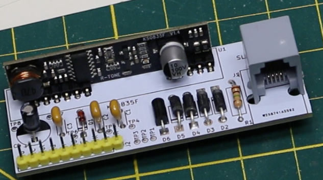

# KS0835F_Phone_SLIC
KS0835F phone line SLIC module breakout pcb 
 
This pcb includes the recommended support circuitry for the subscriber line interface and provides an RJ phone jack, and a header for providing power, control I/O, and audio in/out.
